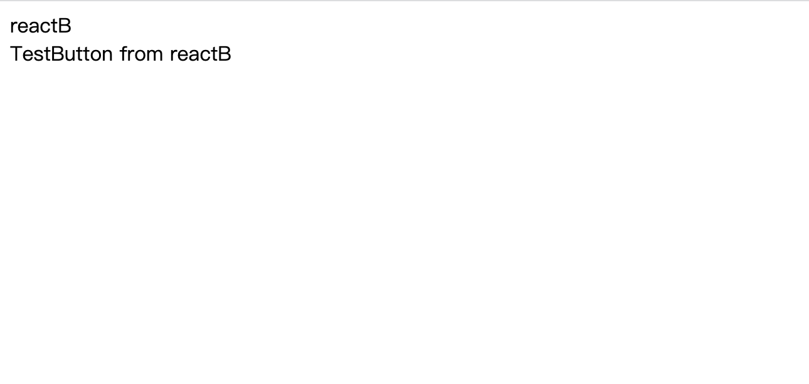
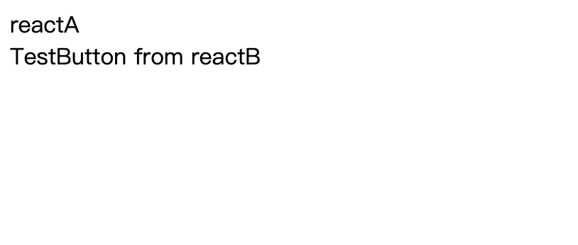

# intruction
A demo of two react projects use webpack module federation

## source structure

- reactA: the project of reactA
- reactB: the project of reactB

more details:

1. reactA mf config
```
reactA\config\mf-config.js
```

2. reactA component use reactB component 
```
reactA\src\app.js
```

3. reactB mf config
```
reactB\config\mf-config.js
```

4. reactB component source code
```
reactB\src\button.js
```

5. reactB component use reactB component in the same project
```
reactB\src\app.js
```
## how to start
```
cd reactB
npm install
npm start

cd reactA
npm install
npm start

```

## result

the component in reactB
<center>


the component used in reactA
<center>


